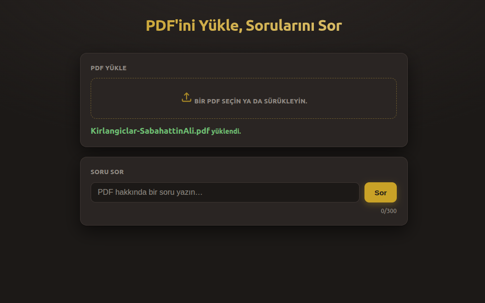
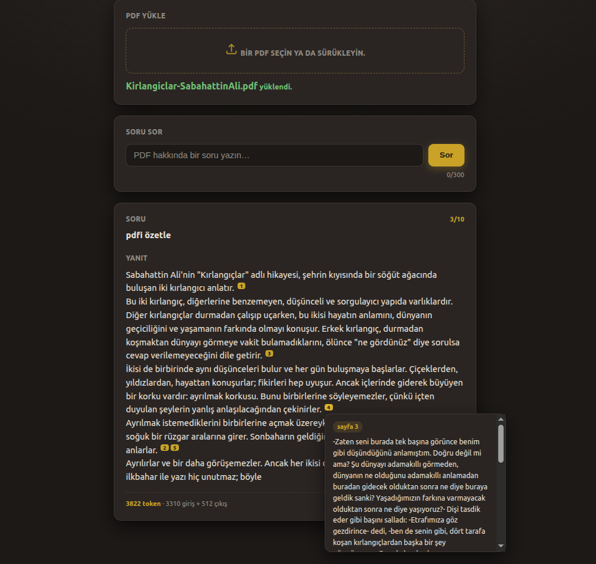
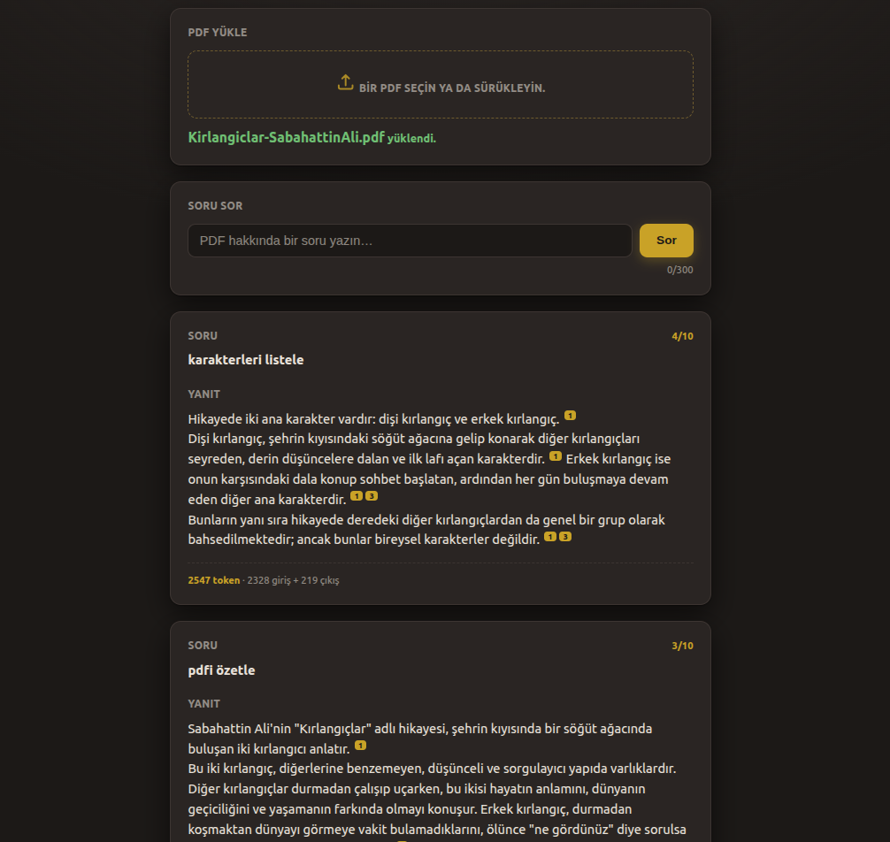

# learnpdf-agent

> A document Q&A learning tool for any PDF

Upload a book, lecture notes or any document. Ask questions in plain language. Get answers grounded in the content with the exact source page cited.

| Layer | Tech |
|---|---|
| Language | Python 3.11 |
| API | FastAPI · Pydantic v2 |
| LLM | Claude API (`claude-sonnet-4-6`) |
| Vector DB | ChromaDB |
| Embeddings | sentence-transformers (multilingual) |
| PDF parsing | PyMuPDF |
| Packaging | Poetry |

<!-- Save the screenshots under images/ with the names below. -->







## How it works

A RAG flow: Each question retrieves the most relevant passages from the PDF, then sends them to Claude in a single call.

1. **Ingest**: The PDF is chunked, embedded, and stored in ChromaDB. Uploading a new PDF replaces the previous one.
2. **Ask**: Your question retrieves the matching passages.
3. **Cite**: The answer references sources inline as `[1]`, `[2]` (click to see the passage). If nothing relevant is found, it says so instead of inventing a source.

## Limits

- Question: max 300 characters
- Output: `max_tokens = 512`
- Daily quota: `MAX_QUESTIONS_PER_DAY` (default 10, set in `.env`)

## Setup

```bash
poetry install
cp .env.example .env   # then set ANTHROPIC_API_KEY=... in .env
```

## Run

```bash
poetry run uvicorn api.main:app --reload
```

Open <http://127.0.0.1:8000>: upload a PDF, ask a question.

## Project Structure

```
learnpdf-agent/
├── src/
│   ├── schemas.py       # Pydantic models
│   ├── ingest.py        # PDF → chunk → embed → ChromaDB
│   ├── retriever.py     # similarity query
│   ├── prompts.py       # system prompt
│   └── agent.py         # RAG flow
├── api/
│   └── main.py          # FastAPI endpoints
├── static/
│   └── index.html       # web UI
├── tests/
│   └── test_agent.py    # tests
├── data/                # PDFs (not tracked)
├── analysis.md          # system analysis
├── state.md             # session checkpoint
├── pyproject.toml       # dependencies
└── README.md
```

`data/` and `chroma_db/` are git-ignored.

## LLM-friendly by design

Three plain-text files keep an AI coding agent on-task across sessions:

* `.claude/CLAUDE.md` — the contract: role, hard rules, architecture, build order
* `analysis.md` — the why: purpose, stack, directory map, invariants
* `state.md` — the checkpoint: what changed, open decisions, next action

## Test

```bash
poetry run pytest
```

Tests mock the Claude API call — no real key or network access required.
